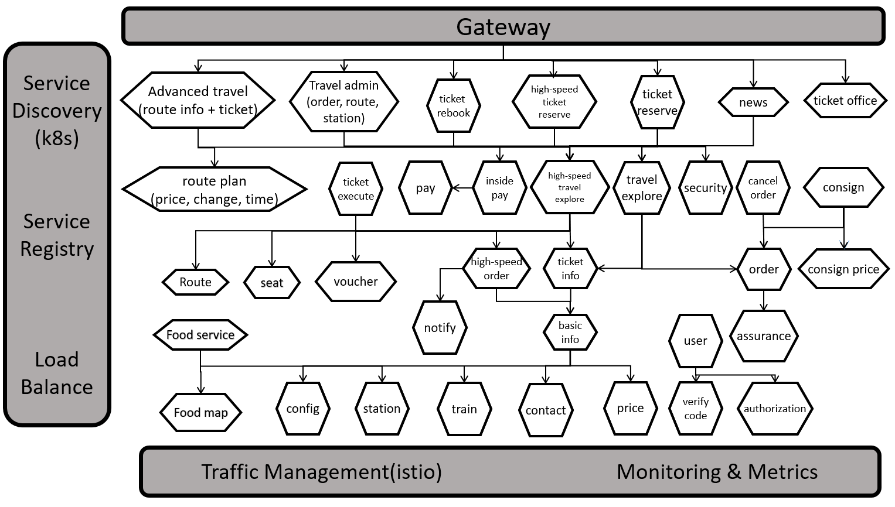

# Overview 
This project focuses on writing test for the train system microservice application (https://github.com/FudanSELab/train-ticket/tree/release-0.0.4) as part of the Testing Microservice Systems course. It includes **component tests** and **integration tests**. 
# Train Ticket：A Benchmark Microservice System

The project is a train ticket booking system based on microservice architecture which contains 41 microservices. The programming languages and frameworks it used are as below.
- Java - Spring Boot, Spring Cloud
- Node.js - Express
- Python - Django
- Go - Webgo
- DB - Mongo、MySQL

You can get more details at [Wiki Pages](https://github.com/FudanSELab/train-ticket/wiki).

## Service Architecture Graph


## Integration Testing 
To run the integration tests, the docker images have to be build first. For that you need to 
1. start your Docker Dekstop and
2. run the command ```bash bash build-docker-images.sh``` in the root of the project. 

That will build all the needed docker immages for the integration tests.
